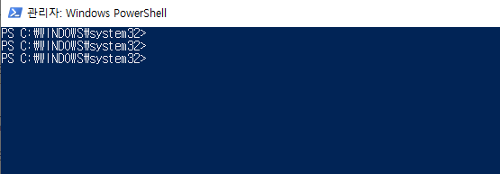
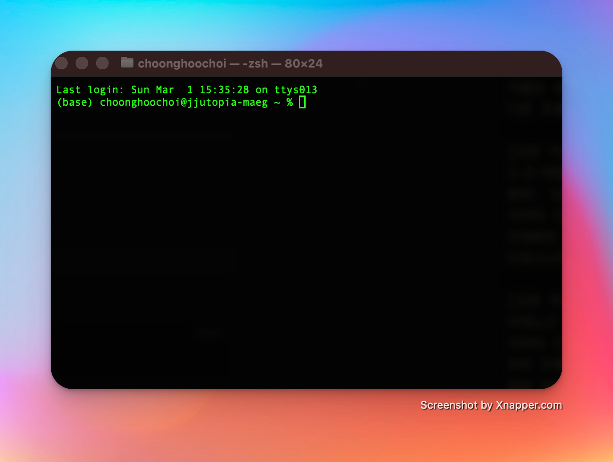
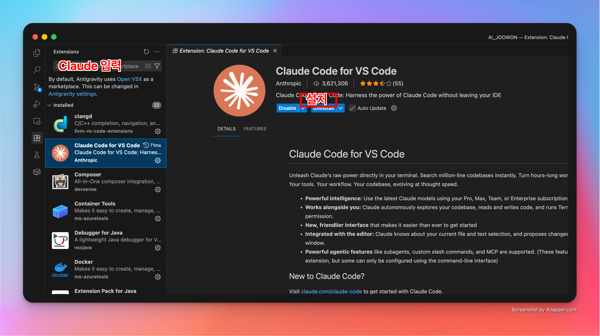

> 안녕하세요.
> 
> 
> 이 가이드는 바이브 코딩을 처음하는 사람을 위한 가이드입니다.
> 초기 환경 설정부터 다루려고 많은 노력을 했습니다.
> 잘 따라와주시고 바이브 코딩에 입문을 응원합니다.
> 
> **해당 가이드는 클로드코드 사용을 기준으로 하였습니다.**
> 바이브코딩의 개념은 다른 AI와 동일하니 이 기준으로 이해하고 사용하시면 됩니다.


> **소요 시간** : 약 30~40분
> 
> 본인의 컴퓨터가 **Mac**인지 **Windows**인지에 따라 세팅법이 조금 차이 있습니다.
> 해당 OS에 대한 섹션만 따라하세요.


## 이 장에서 진행하는 것
- [ ] Github 게정 만들기
- [ ] Claude 계정 & Pro 구독 
- [ ] VS Code 설치
- [ ] Claude Code 설치
- [ ] Claude Code 로그인 (터미널 용)
- [ ] Claude Extension 설치

---

## Step 1. GitHub 계정 만들기

> 스킬 배포 및 공유를 위해 필요합니다.

1. [github.com](https://github.com/) 접속
2. **Sign up** 클릭
3. **Continue with Google** 클릭 → 본인 Google 계정으로 로그인
4. 이메일 인증 완료

> 💡 Google로 가입하면 비밀번호 관리가 편하고, 다른 개발 서비스 가입 시에도 유용합니다.

---

## Step 2. Claude 계정 & Pro 구독

1. [claude.ai](https://claude.ai/) 접속
2. 계정 생성 후 **Pro 구독** ($20/월)

*Claude 말고 다른 것은 안되나요?*
대안으로 ChatGPT Codex, Antigravity, ROO Code도 가능합니다.
하지만, 위 가이드는 Claude Code로 진행합니다. 
그 이유는 개인적으로 생각하기에 현재로선 모델의 성능이 가장 탁월하고 초보자 세팅에도 잘 작동하기 때문입니다.

---

## Step 3. VS Code 설치

> 💡 ==이미 **Cursor** 또는 **Antigravity** 쓰시는 분은 이 단계 건너뛰어도 됩니다!==
> 모두 VS Code 기반으로 만들어진 것이어서 이하 세팅이 완전 동일합니다!(이름만 다른 수준)

1. [code.visualstudio.com](https://code.visualstudio.com/download) 접속
2. 본인 OS(Mac/Windows) 버전 다운로드
3. 다운로드된 파일 실행 → 설치

---

## Step 4. Claude Code 설치 (CLI)

1. VS Code 상단 메뉴에서 **Terminal** → **New Terminal** 클릭
	> 💡 단축키: `` Ctrl + ` `` (백틱, 숫자 1 왼쪽 키)
2. 아래 명령어 복사 → 터미널에 붙여넣기 → Enter
	**Mac:**
	```bash
	curl -fsSL https://claude.ai/install.sh | bash
	```
	**Windows (PowerShell):**
	```powershell
	irm https://claude.ai/install.ps1 | iex
	```
	> CMD(명령 프롬프트)에서는 작동하지 않습니다. 반드시 **PowerShell** 을 사용하세요.
3. VS Code **완전히 종료** 후 다시 열기
4. 터미널에서 확인: `claude --version` 입력 → 버전 나오면 성공!


### 터미널 / PowerShell??
아래와 같이 컴퓨터에 명령을 입력하는 명령어 창입니다.
역할은 컴퓨터에 명령을 내리는 것으로 거의 동일하나 이름이 다른 만큼 쓰는 명령어가 다릅니다.
윈도우에선 PowerShell, MacOS에선 Terminal(터미널) 을 실행하면 보입니다.
**아래부턴 편의상 터미널(Terminal)이라고 표현하겠습니다.**






### ⚠️ Mac 사용자: PATH 설정 메시지가 나올 경우

설치 후 아래와 같은 메시지가 나오면:

```
⚠ Setup notes:
  • Native installation exists but ~/.local/bin is not in your PATH.
```

터미널에 아래 명령어를 **그대로 복사해서 붙여넣기** → Enter:

```bash
echo 'export PATH="$HOME/.local/bin:$PATH"' >> ~/.zshrc && source ~/.zshrc
```

그 다음 `claude --version` 입력 → 버전 나오면 성공!

### ⚠️ Windows 사용자: PATH 설정 (필수)

Windows에서는 `claude` 명령어가 바로 안 되는 경우가 많습니다. 아래 설정을 해주세요.

1. `Win + R` 누르고 → `sysdm.cpl` 입력 → Enter → **고급** 탭 클릭
2. **"환경 변수"** 버튼 클릭
3. **사용자 변수** 에서 **Path** 선택 → **편집** 클릭
4. **새로 만들기** → `%USERPROFILE%\.claude\bin` 입력 → **확인**
5. VS Code **완전히 종료** 후 다시 열기
6. 터미널에서 `claude --version` 다시 확인

---

## Step 5. Claude Code 로그인 (터미널용)

> 터미널에서 `claude` 를 직접 사용하기 위한 로그인입니다.

1. VS Code 상단 메뉴에서 **Terminal** → **New Terminal** 클릭 (단축키: `` Ctrl + ` ``)
2. `claude` 입력 → Enter
3. 테마 선택 → **Light** 또는 **Dark** 선택 (아무거나 OK) 
4. 로그인 방법 → **Claude account with subscription** 선택 
5. 브라우저가 자동으로 열림 → Claude 계정으로 로그인 → **허용** 클릭
6. 터미널로 돌아와서 `안녕하세요` 입력 → 응답 오면 **CLI 설정 완료!**

_터미널(파워쉘) 창에서 명령을 구조받는게 어색할 수 있어요. 타자가 밀리는 느낌이 날 수 있습니다.
그런데 금방 적응되니 걱정마세요._

---

## Step 6. Claude Extension 설치 (VS Code 화면용)

> VS Code 안에서 채팅 패널로 Claude를 쓰기 위한 확장 프로그램입니다. (Step 5와 별개)
> Terminal 창보다 좀 더 UI가 친숙하고 익숙한 채팅창 같습니다.
> 설치를 안해도 Claude Code는 작동합니다. 터미널이 더 좋으면 건너뛰어도 됩니다
> 초반에는 설치해서 하시는 것을 추천드려요.

1. VS Code 왼쪽 사이드바에서 **Extensions** 아이콘 클릭 (네모 4개 모양, 아래 그림 참고)
	> 💡 못 찾겠으면 단축키: Mac `Cmd + Shift + X` / Windows `Ctrl + Shift + X`
2. 검색창에 **Claude** 입력
3. **Anthropic** 제작 확인 후 **Install** 클릭


### Extension 시작

1. 왼쪽 사이드바 첫번째 파일 아이콘 눌러서 파일목록 다시 열기
2. 설치가 끝나면 Claude 익스텐션 패널 열기:
	- 우측 상단 클로드 모양 주황색 아이콘 누르기
	- 또는 단축키: Mac `Cmd + Shift + Esc` / Windows `Ctrl + Shift + Esc` 

### Extension 로그인

1. **Sign In** 버튼 클릭
2. 브라우저에서 Claude 계정 로그인 → **허용** 클릭
3. Claude 패널에 `안녕하세요` 입력 → 응답 오면 **완료!**

---

## 문제 해결

| 증상 | 해결 |
| --- | --- |
| `claude` 명령어가 안 됨 | VS Code 완전히 종료 후 재시작 |
| 브라우저 로그인 후 터미널 반응 없음 | 브라우저에서 "허용" 클릭 확인 |
| Extension이 안 보임 | VS Code 재시작 |
| 로그인이 안 됨 | 브라우저 팝업 차단 해제 |
| 응답이 안 옴 | Claude Pro 구독 상태 확인 |


### npm 설치(OS 무관)
_이전에는 필요했지만 근래엔 경우에 따라 필요한 사항입니다._

npm(node package manager)를 이용한 설치 방식으로 운영체제의 종류에 관계 없이 설치할 수 있습니다. 이 방식을 사용하기 위해서는 [node 설치](https://docs.npmjs.com/downloading-and-installing-node-js-and-npm#macos-or-windows-node-installers)를 먼저 진행해야 합니다. ([Node.js 다운로드 페이지](https://nodejs.org/en/download/))

설치가 완료되었다면 **재부팅**을 진행해주신 뒤에 cmd, powershell, bash 등 터미널을 열고 다음 명령어를 입력해 npm 버전이 출력되면 성공입니다.

Windows 11 환경에서는 Window 키 + X 을 눌러서 '터미널'을 클릭하면 터미널을 열 수 있습니다.

```
npm -v
```


---

## 참고 문서

- [Claude Code 공식 설치 가이드 (한국어)](https://code.claude.com/docs/ko/setup)
- [왕초보를 위한 Claude Code 설치 방법](https://mildit.tistory.com/25)


